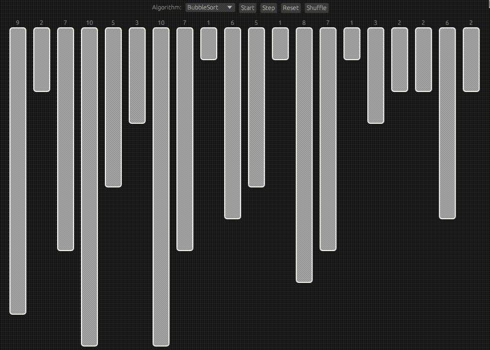

# Sorting Visualizer



> Visualize the execution of the most common sorting algorithms

### TODO

The Sorting Visualizer is a WIP, the following fixes/features still need to be implemented

- [ ] Benchmarks
- [ ] Implement MergeSort
- [ ] Implement QuickSort
- [ ] Implement HeapSort
- [ ] Release using Github

## 💻 Build Dependencies

* Rust 1.65+
* `cmake`, `pkgconf`
* Only tested on Linux, but should work on any OS.

## 🚀 Build

```
cargo build
```

## ☕ Run

```
cargo run
```

